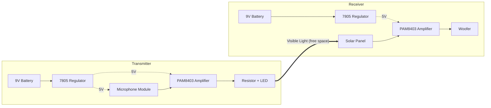

# Li-Fi Audio Transmission
**Streaming real-time audio through free space using visible light, an LED and a solar panel.**

---
## Overview
Traditional wireless communication relies heavily on Radio Frequencies(RF), which suffer from electromagnetic interference, bandwidth congestion and security vulnerabilities. This project demonstrates an alternative: **Li-Fi(Light Fidelity)**
The system captures audio input, modulates it onto a visible light beam via an LED, receives it at a distance using solar panel detector and power amplifier. It is a hands-on implementation of optical wireless communication, showing the potential of light as a secure, high bandwidth data medium. 
## System Block Diagram

---

## Why Li-Fi?
| Aspect | RF (Wi-Fi, Radio) | Li-Fi (Visible Light) |
|---|---|---|
| Spectrum | Congested, regulated | Large, unlicensed |
| Interference | Prone to electromagnetic interference | Immune to RF interference |
| Security | Signals pass through walls | Confined to line of sight |
| Limitation | Crowded bands | Needs clear line of sight |

---

## Components Used
| Block | Transmitter | Receiver |
|---|---|---|
| Power source | 9V battery | 9V battery |
| Voltage regulation | 7805 regulator | 7805 regulator |
| Input/Detector | Microphone Module | Solar Panel |
| Audio Amplification | PAM8403 module | PAM8403 module |
| Optical element | LED | n/a |
| Protection | Resistor | n/a |
| Output | n/a | Woofer |

---

# How it Works
1. **Power:** The 9V battery is regulated to about 5V by the 7805, suitable for the modules.
2. **Capture:** The microphone module converts sound waves into a weak analog electrical signal.
3. **Amplify:** The PAM8403 boosts the signal.
4. **Modulate:** The signal drives the LED (with a series resistor to limit current), making the light intensity vary in sync with the audio waveform.
5. **Transmit:** The modulated light travels through open space along a line-of-sight path.
6. **Detect:** The solar panel converts the varying light intensity back into a small electrical signal.
7. **Reproduce:** The receiver-side PAM8403 boosts the signal and sends it to the woofer.

---
## Circuit Diagram
### Transmitter

### Receiver

> **Note:** The Physical hardware is currently held by the supervising faculty member as part of departmental project custody, so a photograph of the built system is not available. The circuit diagrams above shown are the transmitter and receiver designs.

---

## Results
- **What worked:** Audio-driven light modulation at the transmitter was detectable at the receiver through solar panel, confirming that information was carried over the optical link.

- **What did not:** The recovered output at the woofer was not clear, intelligible audio. It appeared mainly as a shaking/vibrating response, meaning a signal was recovered but was not strong or clean enough for accurate reproduction.

This is a genuine limitation of the prototype, not a total failure: light-based transmission and detection worked, while the amplification and signal-conditioning stages need refinement.

**Likely cause:**
- Insufficient gain at the receiver-side amplifier.
- Mismatch between the weak recovered signal and the woofer's drive requirements.
- Slow response of the solar panel as a detector.
- Noise picked up in the receiver chain.

---

## Limitations

| Limitation | Explanation |
|---|---|
| Line of sight | Any opaque obstruction interrupts the transmission |
| Range | Limited by LED brightness and solar panel sensitivity, best for short-range indoor use |
| Ambient light | Sunlight or Fluorescent bulbs can add noise to the optical signal |
| Signal fidelity | Recovered signal was insufficient for clear audio |

---

## Future Enhancements
- [ ] Use laser diode or optical lenses to extend range and improve focus
- [ ] Try digital modulation techniques (PWM, OFDM) to increase throughput and reduce ambient noise
- [ ] Replace the solar panel with a faster photodiode to improve audio clarity
- [ ] Add a speaker and work according to its specifications

---

